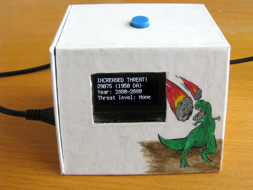

# asentry-gadget

## Device to warn of potential asteroid impacts

This device uses a [Raspberry Pi Pico W](https://www.raspberrypi.com/documentation/microcontrollers/raspberry-pi-pico.html#raspberry-pi-pico-w-and-pico-wh)
and [CircuitPython](https://circuitpython.org/)
to monitor NASA JPL’s [Sentry](https://cneos.jpl.nasa.gov/sentry/) service and
warn of potential Earth-threatening asteroids.

[Click here for more info.](https://lenp.net/projects/asentry/)

If you want to do this on your computer instead of a stand-alone device,
[there’s a Python program for that.](https://github.com/Len42/asentry)
