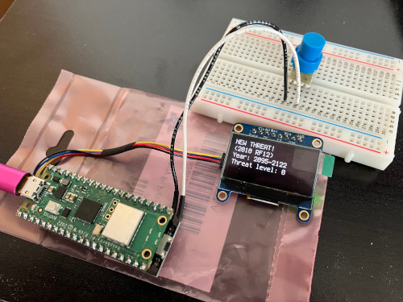

# asentry-gadget

## Device to warn of potential asteroid impacts

This device uses a Raspberry Pi Pico W and CircuitPython to monitor NASA JPL’s [Sentry](https://cneos.jpl.nasa.gov/sentry/) service and warn of potential Earth-threatening asteroids.

If you want to do this on your computer instead of a stand-alone device, there’s [a Python program](https://github.com/Len42/asentry) for that.
